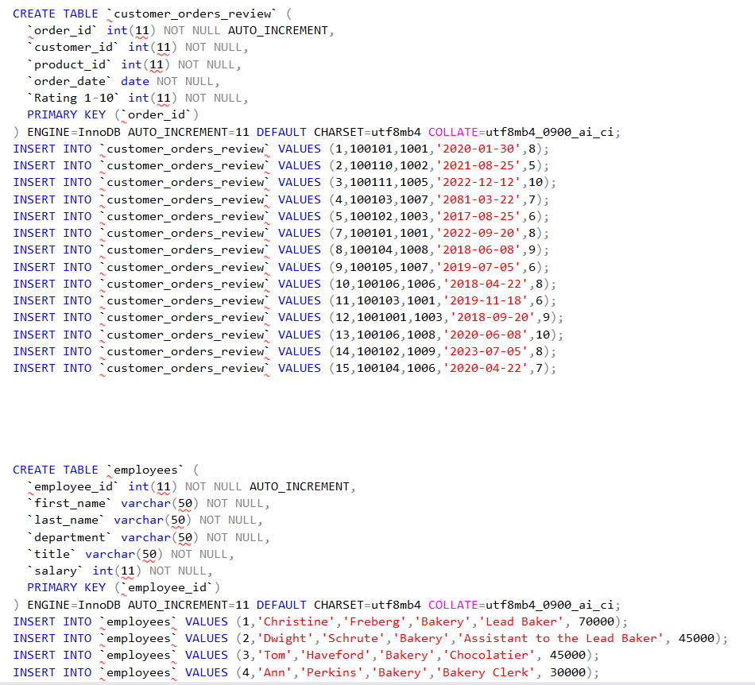
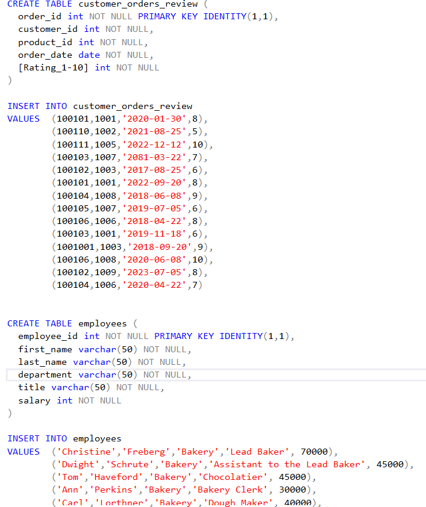

# Bakery Database Project
This repository contains the Bakery Database Project, a database I reconstructed in Microsoft SQL Server (T-SQL). The original design was created in MySQL Workbench by Alex Ferberg, the creator of the database on his MySQL for Data Analytics course on the Analyst Builder website. I adapted and converted the database structure and queries to align with Microsoft SQL Server's syntax and capabilities.

## Project Overview
The Bakery Database Project simulates the operations of a bakery business, covering aspects like inventory, customer management, supplier relationships, and financial data analysis. The project includes database creation, normalization, advanced querying, and view creation, demonstrating the versatility of SQL Server for handling relational data.

# Key Features

1. **Database Creation**
* Created a fully normalized database named bakery, designed for optimal relational data management.

2. **Table Design and Relationships:**
This includes:
* Products: Contains bakery items, their stock levels, and pricing.
* Suppliers: Tracks supplier details.
* Supplier Delivery Status: Manages delivery statuses for supplier orders.
* Ordered Items: Links products to their delivery and status, incorporating cascading updates.
* Customers: Maintains customer profiles, including personal and contact information.
* Customer Orders: Tracks customer purchases, order totals, and optional tips.
* Customer Orders Review: Stores customer ratings for specific orders.
* Employees: Manages employee details, including department, title, and salary.

3. **Constraints and Relationships**
* Enforced referential integrity through primary and foreign keys to ensure data integrity and proper relationships.
* Implemented cascading updates for dynamic table relationships.
* Added default values for specific columns.

4. **Skills Demonstrated:**
* Advanced Database Design and Normalization
* Advanced SQL Querying Techniques
* Window Functions and Aggregations
* Data Transformation and Analysis
* Managing Relationships with Foreign Keys
* Referential Integrity with Constraints
* Cascading Updates and Default Values
* View Creation for Data Simplification
* Data Analysis using SQL

5. **Comprehensive SQL Querying:**
Included various queries for:
* Data transformations
* Analytical insights
* Aggregations
* Window functions
* Date and time manipulations
+ Full query code is available in the file [queries.sql.](4_queries.sql)

6. **Views**
Created views for streamlined querying and analysis:
Example: vw_order_shipped combines customer orders and delivery details.

7. **Project Files**
The repository contains the following key files:
* [1_create_database.sql](1_create_database.sql): Code for database creation.
* [2_create_tables.sql](2_create_tables.sql): Code for table creation with constraints.
* [3_insert_data.sql](3_insert_data.sql): Code for inserting sample data into tables.
* [4_queries.sql](4_queries.sql): Full list of queries written for the project.
* README.md: Project documentation.

8. **Tech Stack**
* Microsoft SQL Server: Used to design, populate, and query the database.
* T-SQL (Transact-SQL): Primary language for database manipulation.

9. **Installation**
1.  Clone or download this repository.
2.  Open Microsoft SQL Server Management Studio (SSMS).
3.  Run the scripts in the following order:
- 1_create_database.sql
- 2_create_tables.sql
- 3_insert_data.sql
- 4_queries.sql

10. **Acknowledgments**
This project was inspired by the Bakery Database example designed by Analyst Builder. The conversion to T-SQL reflects an adaptation to SQL Server's structure and capabilities.

11. **License**
This code was created by Sandra Obanijesu under the GPL-3.0 license. Please feel free to use the resources as you deem fit.